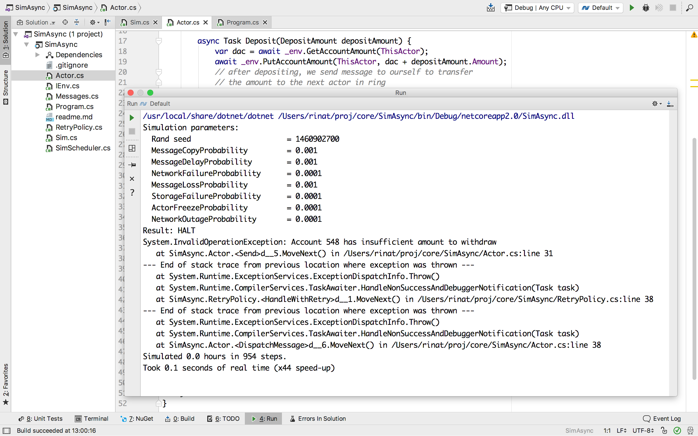

# SimAsync

This project demonstrates plugging into `async`/`await` capabilities
of .NET Framework to run an application in a simulated mode. The
simulation will inject random faults and fast-forward time.

## Previous Projects

This material continues:

* [SimCPU](https://github.com/abdullin/simcpu)
* [SimRing](https://gist.github.com/abdullin/af7c9b7fd4aa58cadcc346c8e194d9ab)
* SimAsync (this)

## About SimAsync

*This simulation is deterministic*. Two runs with the same `Seed`
parameter will yield identical results. 

You can use random `Seed` to discover new failure scenario. You can
also re-use `Seed` from the past to reproduce a simulation run.

*The simulation fast-forwards time*. Although the logic uses random
delays to represent disk delays, freezes or network outages, the CPU
doesn't actually need to sit idle during this delay. We control the
scheduler and we could fast-forward to the next interesting moment in
time. 

Years of the simulated time could pass in hours of real-time.

*Random faults are injected* along the way to represent some of the
bad things that could happen in reality to our code. After all, we
want to capture, debug and fix some of these issues before the code is
deployed to the production.

*Parallel execution is simulated* (even though the simulation itself
is single-threaded). Thanks to the state machines generated by
`await`/`async` we could actually suspend execution of one execution
path for some time, while other paths will continue running.

For example, _Actor 1_ could experience a storage freeze for 10 ms
while reading from the database. Scheduler will switch to the other
pending tasks (e.g. message handling by _Actor 2_) before coming back
to _Actor 1_ to continue execution.

# Questions

- This simulation reveals a problem with the application. What is the
  root cause and how would you fix it?
- This simulation uses an in-memory dictionary as a DB. What would it
  take to implement something real?
- What kinds of failures could you inject into a simulated storage?
- How would you simulate faulty disk controller?
- How would you simulate fail-over between to data centers with eventual replication?

# Bonus

After fixing the first problem discovered by the simulation you are
likely to hit one more (it might require running longer
simulations). How would you handle it?

Remember, that the any simulated logic will eventually be replaced by
the production code. They have to match.

# Tricky Questions

- How would you simulate your favorite database?
- How would you simulate your favorite commit log or message bus?
- How would you simulate a load balancer?

